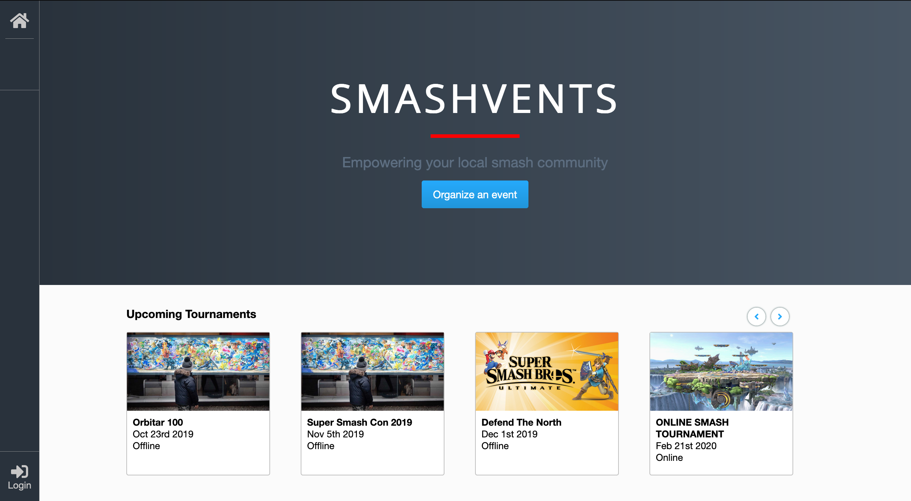
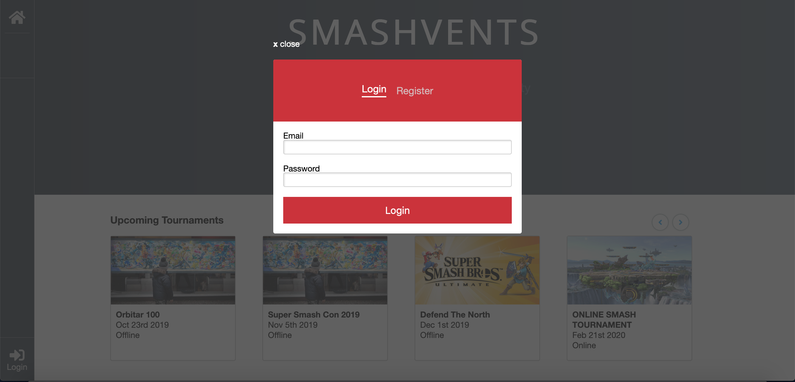
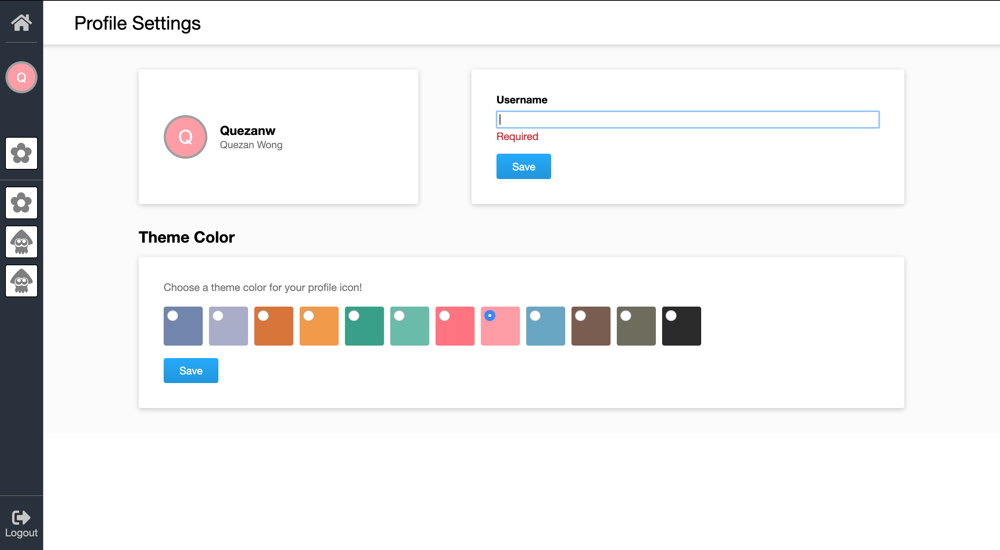
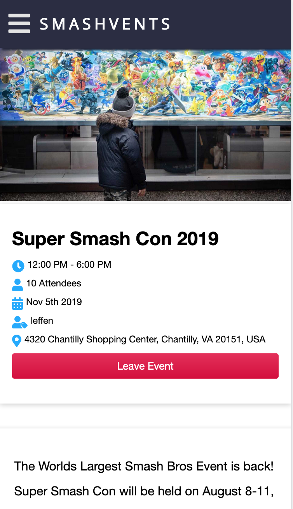
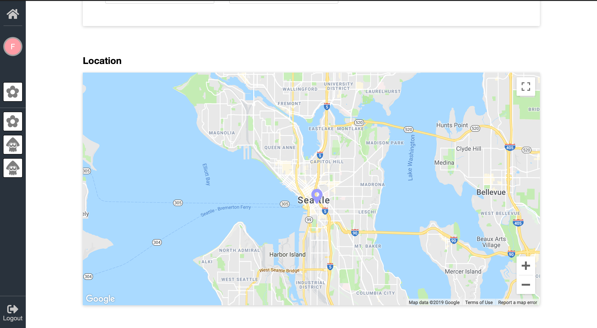

# Smashvents

### Description
Smashvents is a web application used to host local Smash Bros Ultimate events in your community! 

### Features
- Login / Register for an account
- View all upcoming and past events
- View, Create, Edit, and Delete an event
- Edit User profile settings
- View venue location marked in google maps
- Mobile device responsiveness
- Form validations

### Technologies
- React
- Redux
- JavaScript
- Sass
- Express.js
- PostgreSQL